# Build Journey

Posts documenting the build of a competition kart turned autonomous vehicle. Roughly one a week on Wednesdays. New posts append at the bottom — read straight through.

[Follow on LinkedIn :fontawesome-brands-linkedin:](https://www.linkedin.com/in/rubenayla/){ .md-button }

**Jump to:** [Intro](#intro) · [Motor](#motor) · [AI Inventory](#inventory-ai) · [Battery](#battery) · [Why 48V](#why-48v) · [Roll hoop](#main-hoop) · [First drive](#first-drive) · [Steering](#steering-actuator) · [Planetary reducer](#planetary-reducer) · [Reducer build](#planetary-build) · [Steering control](#steering-control) · [Dashboard](#dashboard) · [Autonomous drive](#autonomous)

---

## [Turning a kart into a driverless racing car](https://www.linkedin.com/posts/rubenayla_formulastudent-driverless-umotorsport-activity-7452662533024395266-dB_m) { #intro }

*2026-04-22*

We're turning a kart into a driverless racing car.

{ loading=lazy }

Huge thanks to Henakart. They gave us the whole kart, minus the engine. The rest is on us: the full autonomous stack. I'm on Ü Motorsport Driverless, the URJC student team in Madrid.

I'll post the build from day one, one piece every Wednesday, until the kart's lapping with no one in the seat.

Three stages:

1. Make it electric, so it moves under its own power.
2. Make it remote-controlled, and safe.
3. Make it driverless, so it drives itself around a cone track.

Coming up: motor → battery → braking → steering → compute → testing.

Everything's going into the [kart docs](https://um-driverless.github.io/kart-docs/) so anyone can build it themselves.

---

## [Mounting the motor, and why the first bracket failed](https://www.linkedin.com/feed/update/urn:li:activity:7455251314227429377/) { #motor }

*2026-04-29*

For our kart, the first step is to attach the motor. We kept it simple: a 48V 2000W BLDC kit, which included the controller, throttle sensor, and wiring. Our engineering goes into the battery, the safety system, and the autonomy stack.

Mounting it to a Tony Kart frame was a different job.

The first bracket was PLA, printed on a Bambu Lab. It bolted to the kart's tube frame and held the motor leveled with the rear axle. The bolt holes let us slide the motor to set chain tension. The kart ran on it for months.

{ loading=lazy }

Then it failed in a specific way. The bolt nuts were embedded inside the print, hex pockets buried in the plastic. The nuts were nylon-locking. Tightening the bolts meant fighting the nylon insert's friction, which took enough torque to crack the pocket walls from the inside. The nuts started spinning instead of gripping, the bolts went loose, and we couldn't retighten them because the nuts were buried inside a part we'd have had to destroy to reach them.

Standing in the workshop thinking about the replacement, we asked a better question. Why are we holding the motor horizontally to the sprocket, elevated from the chassis? There's no real reason. We can place the motor on the chassis itself, with a flat welded steel plate. And we can do that ourselves, without waiting for orders.

{ loading=lazy }

We considered fancier options. A grid of shifted holes for positive locking. A tensioner bolt in the style of combustion-engine karts. The slot won because it's the simplest approach, and we could always add a tensioner if the slot ever started moving — but it didn't happen.

{ loading=lazy }

The kit also shipped with a chain in a different pitch than the kart's: T8F (8 mm) versus #219 (7.774 mm). The two look almost identical. We standardized on #219 and laser-cut a custom pinion to fit the motor's D-shaped shaft.

{ loading=lazy }

Months later, the question "wait, which pitch did we use?" kept coming up. That's why everything goes into the [kart docs](https://github.com/UM-Driverless/kart-docs).

---

## [Using an AI Inventory to design PCBs](https://www.linkedin.com/feed/update/urn:li:activity:7456983051160481793/) { #inventory-ai }

*2026-05-04*

We're using an AI Inventory to design PCBs.

"Do we have any DAC chips in stock?" If answering that means going on a trip to the workshop and spending an hour looking for them between bags, we're doing something wrong.

{ loading=lazy }

Nobody wants to do an inventory, so we made it as easy as possible. We set up a tripod over a workshop table, and took pictures of all 270 bags with components.

{ loading=lazy }

Then, Claude identified each component, looked the manufacturer part number up online for description and datasheet, and saved the data into [Notion](https://www.notion.so/) using their MCP connector. It worked at first try.

{ loading=lazy }

Now we can ask things like:

> "Hey Claude, we need to generate two analog signals from an ESP32 — one 0–5V, one 0–10V. What can we use from the inventory?"

And get back:

> "Use the DAC7574 (quad 12-bit I²C, 2 in stock). With VREF = 5V, the first channel gives 0–5V directly. For the 0–10V channel, route the second channel through an LM358 wired non-inverting at gain 2 (R1 = R2 = 10 kΩ, both in stock). Power the op-amp from the kart's 12V rail. Heads up: you're down to 2 DAC7574s. Probably worth adding a few to the next Mouser order."

  

    <iframe
      src="https://www.youtube.com/embed/xWUMcP6Wm6w"
      title="Our Inventory is AI — Formula Student kart"
      frameborder="0"
      loading="lazy"
      allow="accelerometer; clipboard-write; encrypted-media; gyroscope; picture-in-picture"
      allowfullscreen
      style="position: absolute; top: 0; left: 0; width: 100%; height: 100%;"></iframe>
  

Huge thanks to Gabriel Fernández Romero and Adrián for the help.

If you have a similar workflow, try this and share your experience — I'm loving it so far.

---

## [Building the battery pack from bare cells](https://www.linkedin.com/feed/update/urn:li:activity:7460644047704100864/) { #battery }

*2026-05-14*

We made the battery pack ourselves. Why?

To practice. And because we had a bunch of cells lying around from a past project that never used them: 60 Molicel P42A 21700 cells, bought for an electric-vehicle experiment that never happened.

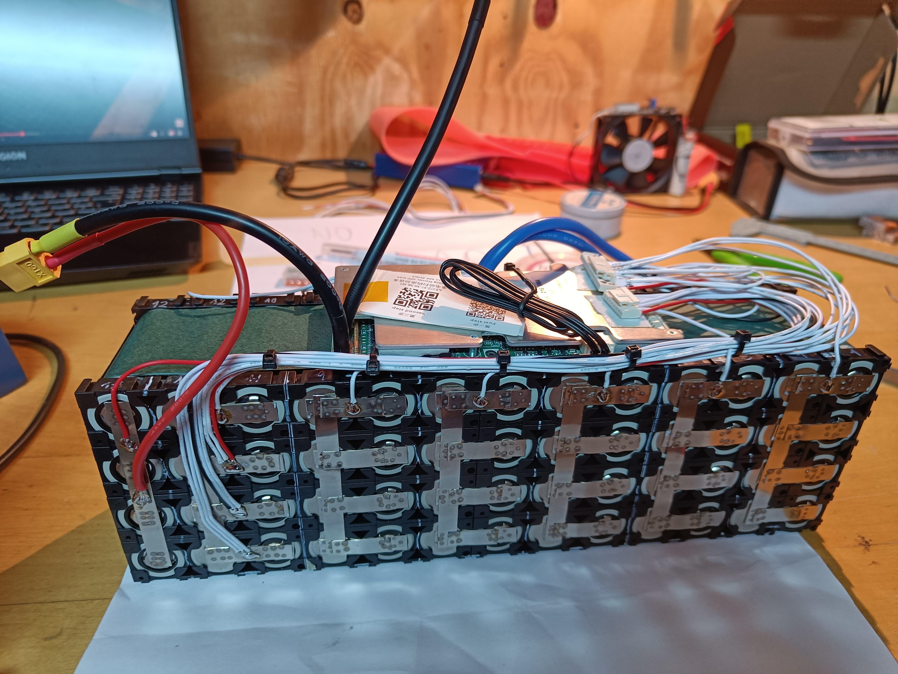{ loading=lazy }

We needed roughly 48V, so 13 cells in series, 46.8V nominal. The motor draws around 2 kW continuous, so the pack could deliver close to five times what the kart actually asks for. It's the first pack we've ever built, so we wanted big safe margins and no power issues for the computer.

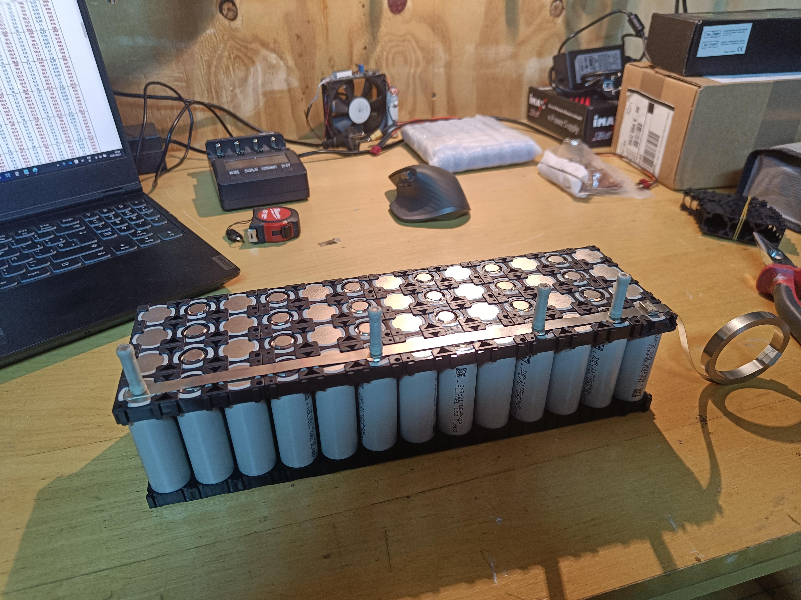{ loading=lazy }

We connected the cells with classic nickel strips. All the current actually flows through the series connections between groups, so the first strip goes in series, then a parallel strip, then another series strip. That's 8 strips per series link sharing the load. At 43 A continuous that's about 5 A per strip. Plenty of margin, and even at the per-cell limit of 45 A each strip stays inside its burst range.

We did the welding with a kWeld. It's funny how it pulses so much current that the magnetic field between its two leads shoves them sideways.

  <video controls playsinline preload="metadata" style="width: 100%; border-radius: 8px;">
    <source src="/videos/battery-spot-weld.mp4" type="video/mp4">
  </video>

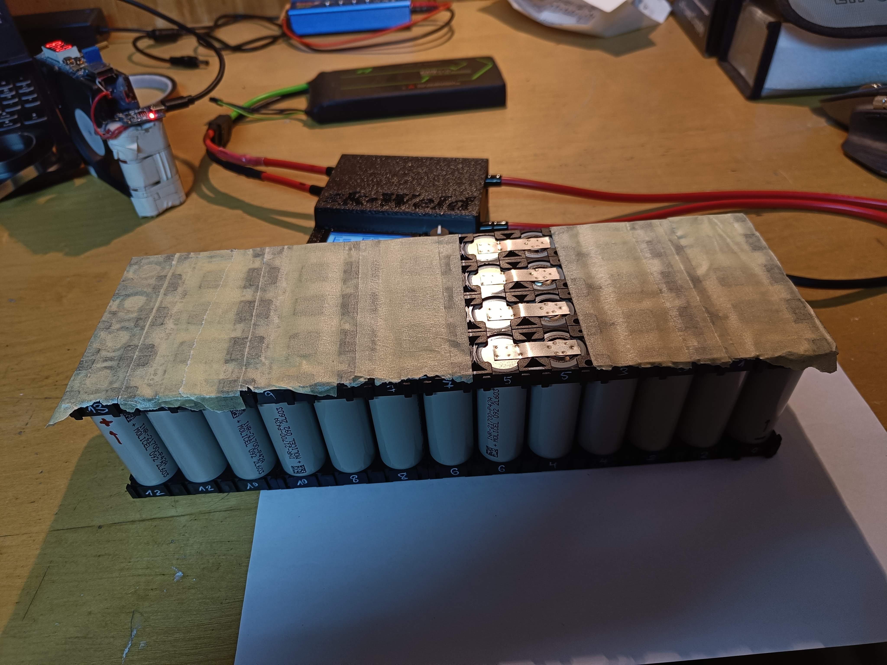{ loading=lazy }

For monitoring, a JBD (Jiabaida) smart BMS with Bluetooth, so we can watch every cell's voltage and state of charge. The Bluetooth advertises continuously waiting for a phone to pair, which we assumed would slowly drain the pack, but after months sitting idle the voltage barely moved.

The pack lives inside a 3D-printed shell with fireproof expanding foam packed around the cells. We drilled two holes, one for the nozzle and another to vent the displaced air, but didn't have the proper applicator gun. The photo below is the result of using pliers to push the bottle open. It was a mess, but it worked. We learned that waiting to do things "properly" can make you wait forever; sometimes you just do it with what you have. Counterintuitively, aiming for fast progress catches errors earlier and makes the end result higher quality.

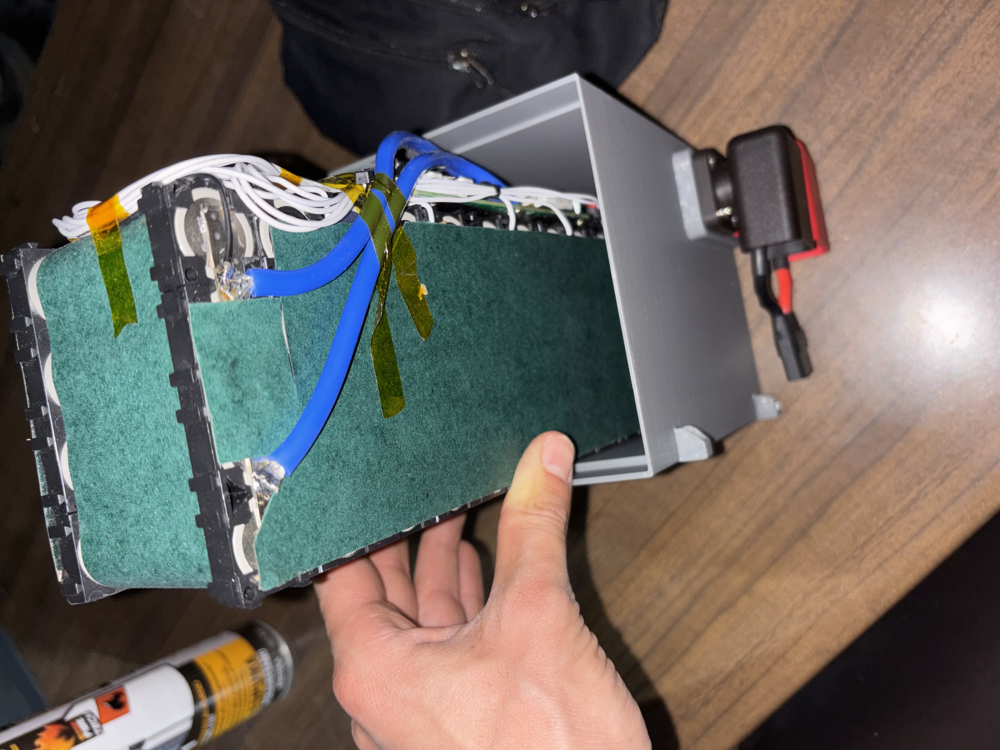{ loading=lazy }

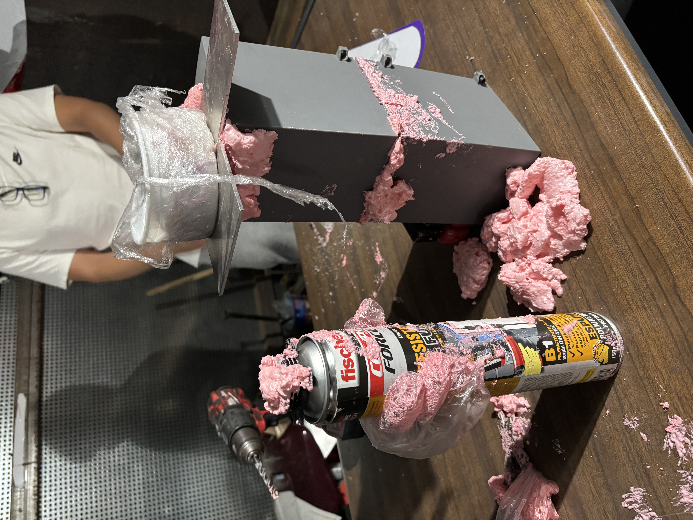{ loading=lazy }

The whole thing took over 10 hours of work: cells in holders, several layers of nickel strips welded between them, 13 BMS wires soldered and routed cleanly, kapton tape and fish paper so nothing shorts, the printed box, the foam, the cure, plus all the planning and buying the right components. Now I understand why packs cost so much more than just the cells. The amount of time it takes is ridiculous.

But we got a fantastic pack in the end. We can drive as hard as we can, continuously, and the internal temperature never rises more than 10°C above ambient.

It's interesting to think about how we'd build this at scale. The process would have to be entirely different: CNC machines doing the spot welding, pre-made connectors with the layout, maybe a dedicated channel in the cell holders to route the wires through with a jig to place them easily. Automating the BMS-wire soldering would be awkward.

---

## [Why 48V, and not more](https://www.linkedin.com/feed/update/urn:li:activity:7462034279871643649/) { #why-48v }

*2026-05-18*

A common question is: why 48V for the kart battery?

There are two reasonable battery voltages for our kart: under 50V, or several hundred volts. The middle doesn't make sense.

What hurts you is the current through nerves and the heart. Voltage is what drives that current, and your body's resistance to it isn't constant. Skin is mostly capacitive, so it lets AC through more easily than DC, because alternating current keeps charging and discharging the outer layer and leaking into the nerves underneath.

The resistance of skin drops when you raise the voltage, as it starts breaking down, so doubling the voltage doesn't make it twice as dangerous: it causes roughly 3x the current and the safe exposure time drops an order of magnitude. Around 10 mA your muscles lock around the wire and you can't let go. Around 50 mA your heart fibrillates.

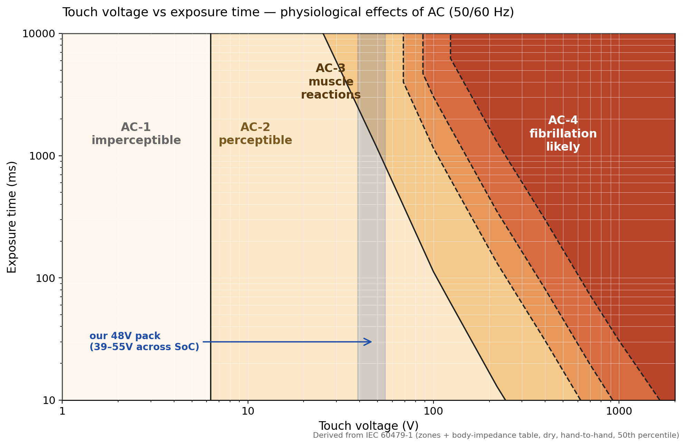{ loading=lazy }

There's no clean threshold, but in the 40–60V range the risk rises very fast, from negligible to significant.

So our pack lands at 13 cells in series, near the highest that can be touched without worry. Anything higher and we'd be building a high-voltage kart: isolation, interlocks, insulated tools, training for anyone who touches it.

---

## [A roll hoop, a bearing spacer, and a throttle sensor](https://www.linkedin.com/feed/update/urn:li:activity:7462759132736114688/) { #main-hoop }

*2026-05-21*

Karts don't come with roll hoops. They sit low, weigh little, and drivers don't wear seatbelts. In a flip, an unbelted driver gets thrown clear: the kart slides on, the driver lands and tumbles. A hoop bolted overhead turns that into a cage you can't be ejected from, and a kart you can be pinned under. So competition karts ride open.

In our driverless kart we want to be as close to a Formula Student car as possible, and FS cars have seatbelts and roll hoops. On top of that, we needed a high, rigid spot for the stereo camera, which a roll hoop gives us.

We reused the main hoop from a past season's FS car. Its tube ends were round, but bolts need a flat surface to clamp against. We heated the ends with an oxy-propane torch until red, pressed them flat in a hydraulic press, drilled the bolt holes, and bolted the hoop down. It still needs a support bar across the top to stiffen it. That's the next job.

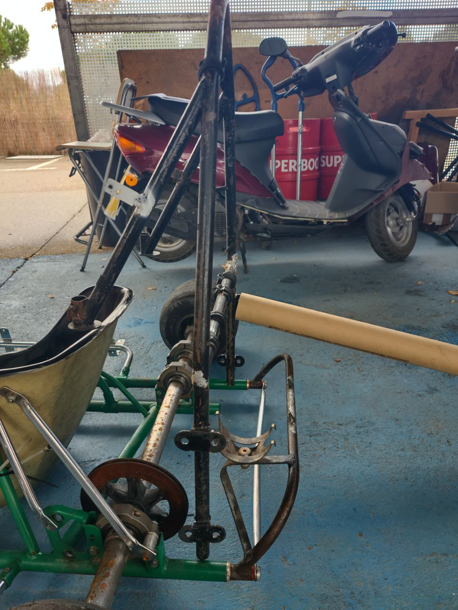{ loading=lazy }

Thanks to our friends at RB Sistemas for helping with this part.

Next are the wheel bearings. Each wheel has two, one on each side of the rim, with the axle through both. We torqued the axle nut and the wheel didn't spin freely: without a spacer between the inner races, the clamp force could only travel through the bearings themselves. So we cut a tube to length as a spacer and installed it, so the inner races are pressed against the spacer by the nut. Now the bearing only has to take the lateral loads of the kart turning.

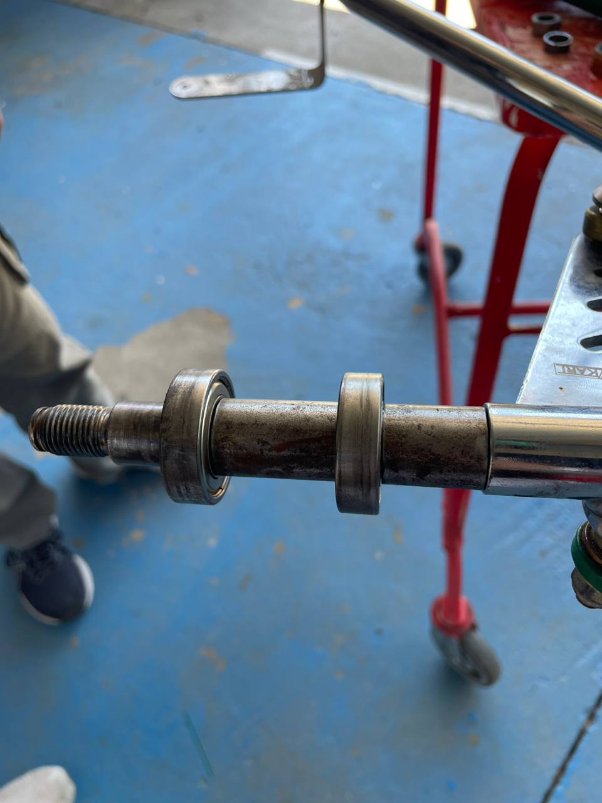{ loading=lazy }

The kart already had its own accelerator pedal. We needed a sensor on it to read its position, so we took the hall sensor that came with the motor kit and installed it on our pedal with a threaded rod to the chassis. It reads the strength of a magnet and outputs an analog voltage between 0 and 5V.

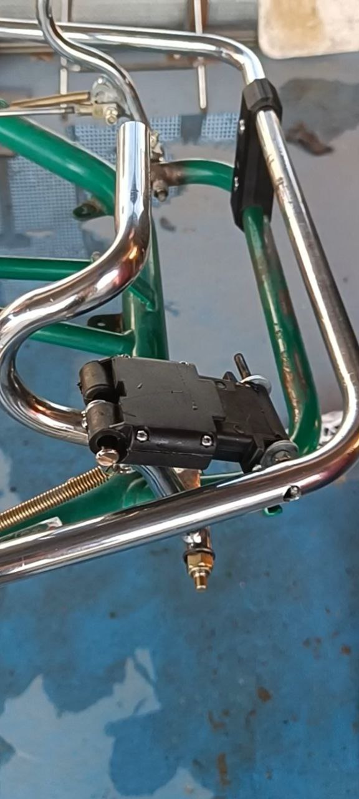{ loading=lazy }

Next: the first manual drive. Everything's going into the [kart docs](https://um-driverless.github.io/kart-docs/) so anyone can build it themselves.

---

## [The first manual drive](https://www.linkedin.com/feed/update/urn:li:activity:7465296164049977346/) { #first-drive }

*2026-05-27*

Finally, the kart works.

  <video controls playsinline preload="metadata" style="width: 100%; border-radius: 8px;">
    <source src="/videos/first-manual-drive.mp4" type="video/mp4">
  </video>

On one of the first runs, the motor pinion gave out. It was a 3D-printed plastic placeholder; we'd been waiting months for the proper machined metal one. The D-profile on the bore rounded off against the motor shaft. The actual cause was the nut backing off, letting the pinion wobble. We swapped in a left-handed nylon locking nut instead of the one that came with the kit, and that fixed it.

We have a kart that moves. Next step is to make it remote-controlled.

In parallel, we're working on the code. There's a [legacy Python codebase](https://github.com/UM-Driverless/driverless) with multithreading from before LLMs were a thing, and the plan is to rewrite it in ROS 2.

---

## [Making the kart steer itself: the actuator search](https://www.linkedin.com/feed/update/urn:li:activity:7470401788328914944/) { #steering-actuator }

*2026-06-10*

Here we are, with a completely manual kart, and we have to make it turn itself.

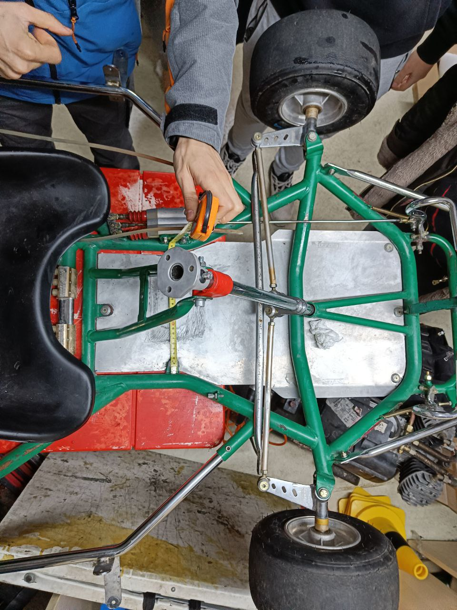{ loading=lazy }

The idea is simple: put an actuator on the steering column to turn it.

But you can't imagine how hard it was to find components for that. Some companies make custom actuators, but we didn't find simple off-the-shelf solutions. They're either too weak, designed for a street car, or built for industrial applications: huge, heavy, and expensive.

For reference, we need about 8 Nm of torque at the steering column to fully turn the wheels while the kart is stopped and loaded with a driver, on grippy floor, which is the worst case. We set a maximum of 0.15 seconds to move the wheels side to side (50 degrees). That's about 6 rad/s, so P = τ·ω = 8 Nm × 6 rad/s ≈ 47W.

There are two main ways to turn it:

1. A rotary system, where you put a gear on the steering column and another on the servo, and that transfers the turning motion.
2. A linear system, where the actuator moves linearly and acts on a lever that turns the steering column.

Linear actuators can provide a lot of force in a compact way, but they can't be backdriven (they lock up), so the kart can't be ridden manually with one unless you use ball screws, which are expensive. On top of that they're slow. You get a lot of reduction, but watt for watt they can't deliver that much mechanical power, and the movement ends up too slow to compensate.

Think about it intuitively: power = torque × angular velocity (P = τ·ω). We can get the same power with a lot of torque or a lot of angular speed.

The torque a motor applies comes from the current flowing through it, which also heats the coils. The coils have a maximum temperature they can withstand, so cooling capacity limits torque directly. For speed, the limits are the mechanical strength of the rotor (so it doesn't explode) and the back-EMF it generates by turning fast. To hit those limits the motor has to spin really fast.

So if we want a lot of power from a small motor, we make it spin fast and gear it down for the torque we need. That's why we went with a rotary actuator.

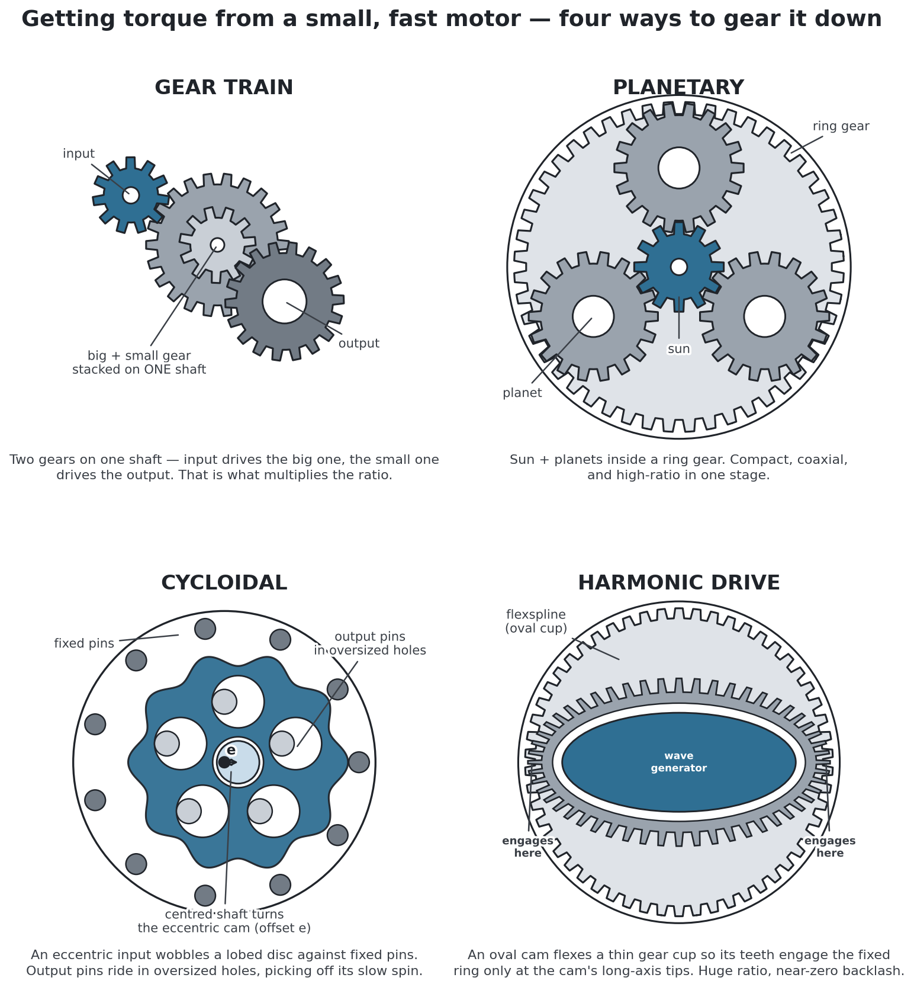{ loading=lazy }

How would you gear it down? Anything from the diagram above, or something else?

Steering system docs: [um-driverless.github.io/kart-docs/assembly/steering](https://um-driverless.github.io/kart-docs/assembly/steering/).

---

## [Why a planetary reducer](https://www.linkedin.com/feed/update/urn:li:activity:7477360277299208192/) { #planetary-reducer }

*2026-06-29*

Last time we talked about the decision to make our own actuator. Why a planetary reducer, of all things?

A belt needs a tensioner. A worm or a screw won't backdrive, so the wheels lock if the power dies. A harmonic drive needs a steel flexspline you can't just print if you want any strength.

We could use a plain gear train between the motor and the steering column, using both shafts. The disadvantage is the added slack.

A cycloidal drive could also work, but it's more complex and needs specific components we'd have to order, which would delay the project, especially while we still don't know the details of this little subsystem. It's a good alternative, and we're not discarding it, but for now we go with the (somewhat) simpler planetary reducer.

For us, the fastest way to get a prototype working is to 3D-print the planetary reducer to match a motor we already have. That motor comes from an old massage chair.

<video controls playsinline muted preload="metadata" style="width: 100%; max-width: 720px; display: block; margin: 1em auto; border-radius: 8px;">
  <source src="/videos/planetary-cad.mp4" type="video/mp4">
</video>

Our first prints stripped out under the steering loads. A tougher filament would probably hold, but a spool of it costs more than just buying the gear. So we stopped printing and adjusted the design to use a standard steel gear from Norelem.

Next week we'll talk about the exact design.

Steering/planetary docs: [um-driverless.github.io/kart-docs/assembly/steering](https://um-driverless.github.io/kart-docs/assembly/steering/).

---

## [The reducer, built](https://www.linkedin.com/feed/update/urn:li:activity:7478085104381145088/) { #planetary-build }

*2026-07-01*

Last post we chose a 3d printed planetary reducer to fit the motor we already had. We redesigned it a few times before it held up on the kart.

We used a laser-cut steel bracket tig-welded to the chassis. The motor face has threaded holes, so it bolts straight to the reducer casing with the steel bracket sandwiched between.

The first holder deformed under the load so much that the big gears started skipping teeth. We redesigned it so the lid holds a bearing and makes the distance between the gears constant. Also did smaller fixes like adding a cover so the planets don't get stuck on inner bolt heads, and playing with tolerances. The video doesn't include these fixes yet.

<video controls playsinline preload="metadata" style="width: 100%; max-width: 340px; display: block; margin: 1em auto; border-radius: 8px;">
  <source src="/videos/steering-planetary-built.mp4" type="video/mp4">
</video>

All this work let us find the real bottleneck: the D-flat coupling of the sun gear with the motor shaft strips out. PLA, ABS, and Nylon all break.

We redesigned it to use a standard steel gear from Norelem, and did some tests by limiting the PWM to about 40% in the meantime.

Now we have a reducer that turns the steering column when we power the motor. Next we have to control the angle precisely. We're basically building a servo.

Steering/planetary docs: [um-driverless.github.io/kart-docs/assembly/steering](https://um-driverless.github.io/kart-docs/assembly/steering/).

---

## [Making the steering hold an angle](https://www.linkedin.com/feed/update/urn:li:activity:7478809848940310528/) { #steering-control }

*2026-07-03*

Plug a battery straight into the steering motor and the steering just swings hard to one side. We need it to stop at the exact angle the software asks for instead.

For that, we obviously need a way to know where the steering is pointing, and a way to control the power we apply. Then some brains will decide how much power we need to reach the angle we want.

We sense the angle with an amazingly cheap and effective chip: a Hall-effect angle sensor (an AS5600, about €3). If you put a magnet nearby, it tells you the angle of the magnetic field. The magnet can move around in space and the sensor still picks up the angle, as long as it's close by.

To control the power of the motor you need to control the current. This paragraph goes into unnecessary detail about it, just so we understand from first principles why it's done the way it is.

If you wanted to apply just a little bit of power (a small current), you'd need to somehow stop the electrons of the battery from flowing to the motor. The obvious way is with a resistor in series, which limits the current and makes the motor's voltage drop smaller.

The problem is that it wastes energy. The only way to prevent it is to have infinite resistance, which means an open circuit and no power flows anywhere, or 0 resistance, which means a perfect wire with no voltage drop. Anything in between wastes energy, which means there's a voltage drop causing heat in the electronics.

So, if we want to control the power without wasting energy, we switch really fast between those two efficient states. One applies power and the other doesn't.

That's done with an H-bridge. It's just a PCB with MOSFETs that switch the power on and off really fast. It can control the polarity of both wires of the motor, so it needs 4 switches wired in an H. That's where the name comes from. The one we use is a Cytron MD25HV. Thanks to Cytron for sponsoring it! There aren't many H-bridges that handle these higher voltages, and this one worked perfectly for us.

Then we just need to figure out how much power to apply, by comparing the angle we have and the angle we want. That goes to a PID algorithm running on an ESP32, which outputs the PWM signal we talked about. That signal goes to the H-bridge, which powers the motor.

Now we need to tune the PID values so it delivers the right amount of power without oscillating.

You can see in the video how it responds to our commands. Oh, and the dashboard we built to control everything from our phones. We'll go into more depth on that in another post.

<video controls playsinline preload="metadata" style="width: 100%; max-width: 340px; display: block; margin: 1em auto; border-radius: 8px;">
  <source src="/videos/actuator-gears-polished.mp4" type="video/mp4">
</video>

Steering system docs: [um-driverless.github.io/kart-docs/assembly/steering](https://um-driverless.github.io/kart-docs/assembly/steering/).

---

## [A dashboard on your phone](https://www.linkedin.com/feed/update/urn:li:activity:7479791570385420288/) { #dashboard }

*2026-07-06*

When the kart misbehaves, you can't tell why unless you can see what it's thinking.

That's why we built a dashboard. It shows the kart's internal state live: the steering angle, the cones it detects, where it thinks it is, and where it wants to go. Without that you're debugging blind. You know it went the wrong way, but not which signal lied.

<video controls playsinline preload="metadata" style="width: 100%; max-width: 340px; display: block; margin: 1em auto; border-radius: 8px;">
  <source src="/videos/phone-dashboard.mp4" type="video/mp4">
</video>

We were thinking about adding a panel with buttons and LEDs. Then we thought, why not a touchscreen like in the Formula car, so we can control the mission, the shutdown system state, and see values from the sensors? A dashboard where we can see and control everything.

After some thought we realized we already had the best possible dashboard: our phones. Great touchscreen, built-in battery, and you already have it always with you. A ROS 2 node on the Orin serves the web dashboard, and any phone can open it. Since AI makes this effortless, we tried it. And we loved it.

The only mess is the Wi-Fi. The Orin runs JetPack, NVIDIA's modified Ubuntu, and it can't hold two Wi-Fi connections at once, so we can't have internet and the local dashboard network at the same time. We opted to deploy online using Cloudflare and a custom domain, so we have internet and the dashboard is no longer local. This is practical for testing but requires a phone with a mobile hotspot. We'll soon try USB-tethering the phone's internet to the Orin, freeing the Wi-Fi for the local dashboard. That way, even without internet the dashboard still works.

Dashboard docs: [um-driverless.github.io/kart-docs/software](https://um-driverless.github.io/kart-docs/software/).

---

## [The first autonomous drive](https://www.linkedin.com/feed/update/urn:li:activity:7481241167268077568/) { #autonomous }

*2026-07-10*

This is the first time the kart really drives itself. It's jerky and slow, but it works.

<video controls playsinline preload="metadata" style="width: 100%; max-width: 720px; display: block; margin: 1em auto; border-radius: 8px;">
  <source src="/videos/kart-first-autonomous-drive.mp4" type="video/mp4">
</video>

To get here, we first tuned the steering PID controller until it ran stably — values of 1.50, 0.0, 0.02, at 500 Hz on the ESP32.

For the control logic we used the most stupidly simple steering algorithm you can imagine: take the first two cones, average their positions, and point the wheels at that midpoint.

In parallel we're developing and testing Pure Pursuit, a Stanley controller, Model Predictive Control (MPC), and even an end-to-end neural network in a simulator. We'll compare all of them on the track soon — they didn't work in reality yet because they need more real-world tuning.

To find the cones from the cameras we use YOLOv11s. We took the foundation from [some old code](https://youtu.be/wZSFr2eYE4M) and significantly improved the training for our specific case.

The next step is enabling the ZED camera's built-in object tracking, specifically its Kalman filter. Right now the cones sometimes disappear or jump back and forth frame by frame. The Kalman filter will track them consistently, keeping their IDs and predicting positions even through dropped frames.

Software docs: [um-driverless.github.io/kart-docs/software](https://um-driverless.github.io/kart-docs/software/).

---

<!--
PLACEHOLDER — upcoming post: "Making it fast" (cone detection → 81 FPS on the Jetson Orin)
Stage 2 of the perception-speed story. Stage 1 (Deteccion_conos, multithreading + polymorphic
rewrite, ~8→50 FPS) lives on the Formula Student page. This post covers the ROS 2 + AI-era
optimizations: FP16 + TensorRT (.pt → .engine, layer fusion), sky-crop, jetson_clocks, ZED VGA
672x376, nano→small model → 81 FPS while running the dashboard + server. Source draft:
~/ruben-files/videos/kart/linkedin/posts/making_it_fast/ (Rubén publishes, then migrate here).
Add as a dated ## section with #anchor and update the "Jump to:" line when it ships.
-->

*That's the latest post. New ones land roughly every Wednesday — [follow on LinkedIn](https://www.linkedin.com/in/rubenayla/) to catch them as they ship, or check back here.*
