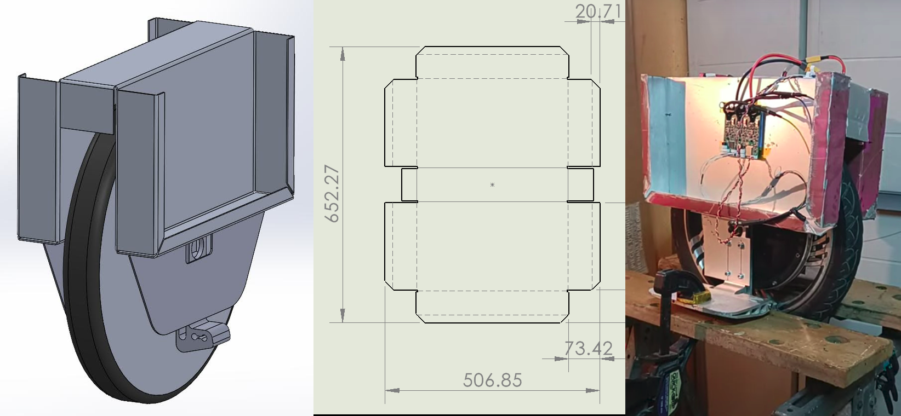

# { width="380" }

**Open-source electric unicycle · 2022 – present · Hardware + firmware, fully open.**

An electric unicycle (EUC) built to be trusted and repaired: waterproof, crash-resistant, and designed so that losing power is treated as a fatal design error, not the rider's fault. Hardware and firmware are open so the community can repair and modify them, free of the proprietary restrictions that lock down commercial wheels.

[:material-book-open-variant: **Documentation**](https://rubenayla.github.io/cyberwheel/){ .md-button .md-button--primary }
[:material-youtube: Pitch Video](https://youtu.be/mN5FoosNMC0){ .md-button }
[:fontawesome-brands-github: Source](https://github.com/rubenayla/cyberwheel){ .md-button }

{ loading=lazy }

## Why it exists

Commercial EUCs are powerful but fragile: proprietary hardware and firmware block repairs, rain alone can kill them, they overheat with no sensors to catch it, and battery fires are a real risk. Worst of all, a power cutout at speed throws the rider — and it's usually blamed on the rider rather than the design.

Cyberwheel's core rule: **a well-designed EUC should never cut power, even if you try.** That means margin on both sides — undervoltage and overvoltage — using ideas like resistor or motor-coil short-circuit braking instead of dumping charge into an already-full battery.

## Design highlights

- **Sealed electronics and battery compartment** — waterproof enough to survive rain, puddles, and worse.
- **Chassis as heatsink** — aluminium structure doubles as thermal mass so the electronics don't overheat under load.
- **Multifunction handle** — kickstand, lock-to-a-pole arm, and seat in one folding part.
- **Built-in charger** and a **fireproof battery cover.**
- **Repairable by design** — modular assembly, open hardware and firmware.

## Target parameters

~50 km/h · 80 kg rider · 16″ or 18″ wheel · 20s 84 V pack · hollow-bore high-torque motor (C38 / C30 class) · hill-climbing, no suspension.

---

**Full build docs, requirements, and battery work:** [rubenayla.github.io/cyberwheel](https://rubenayla.github.io/cyberwheel/)
