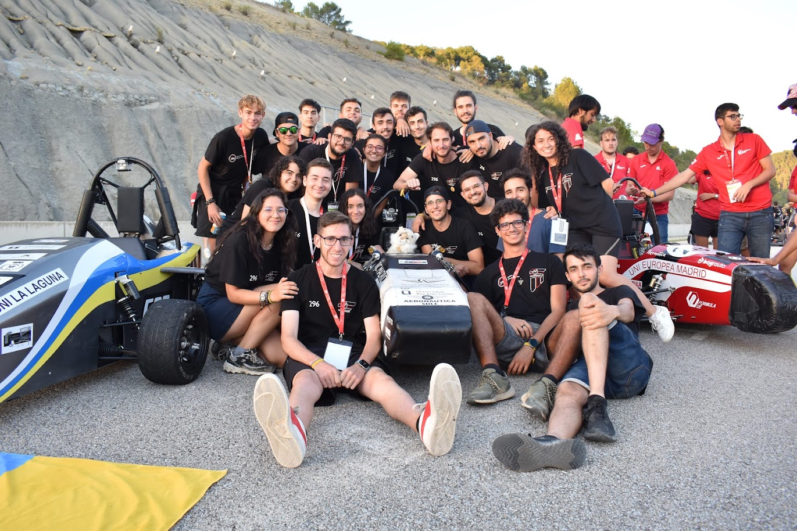
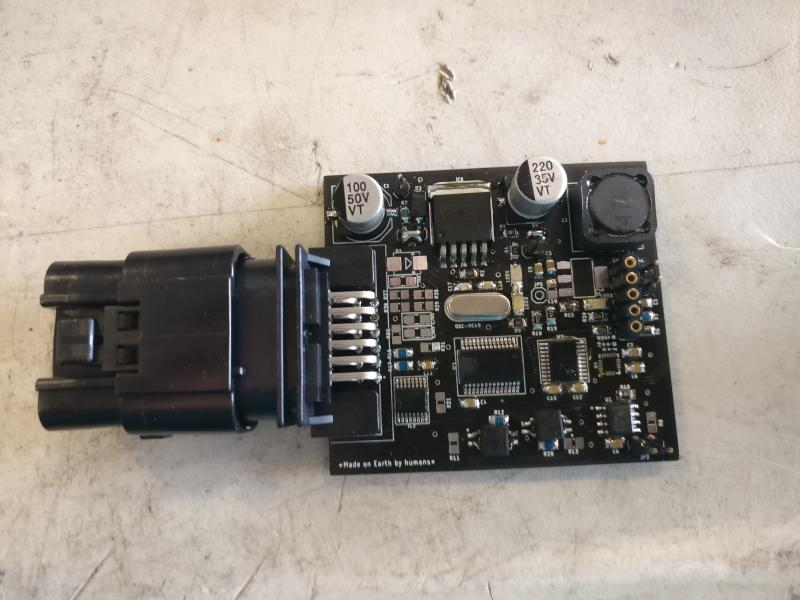
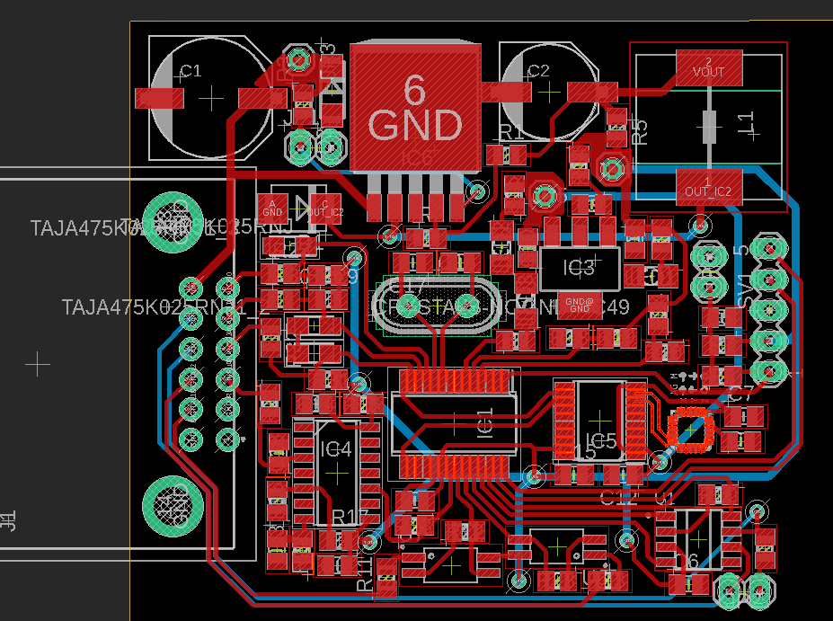
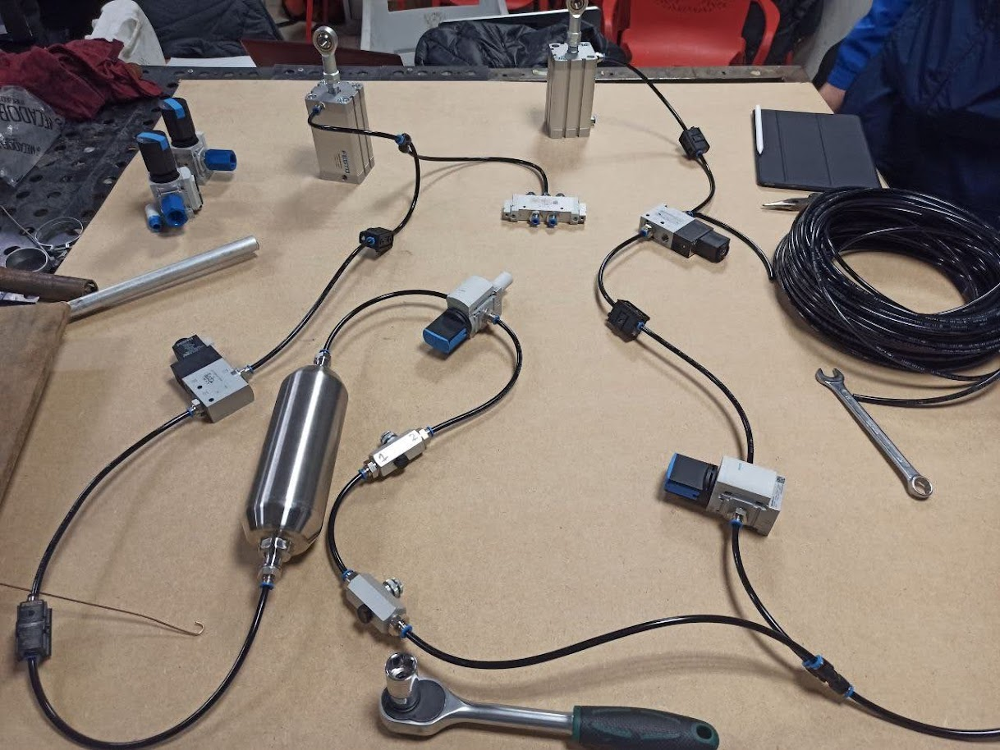
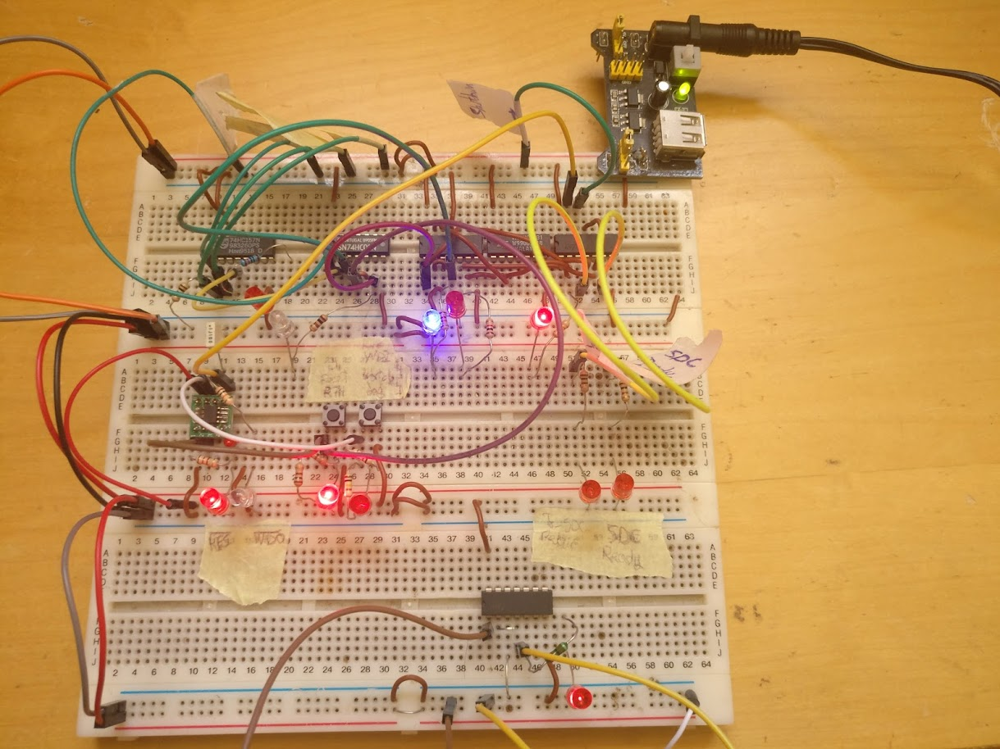
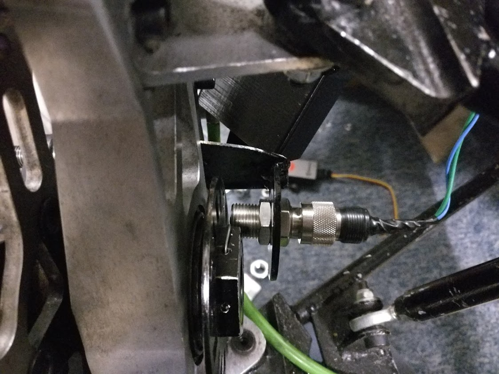
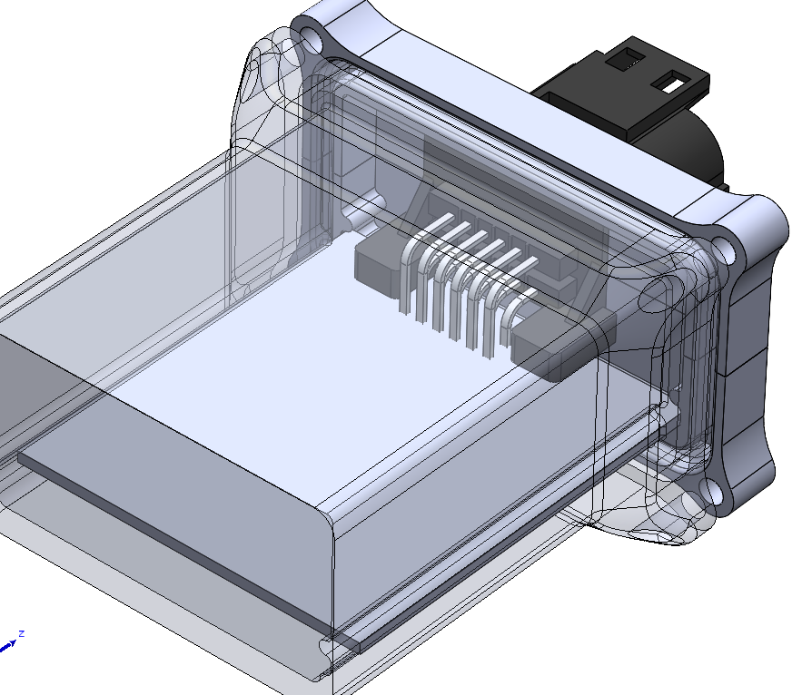
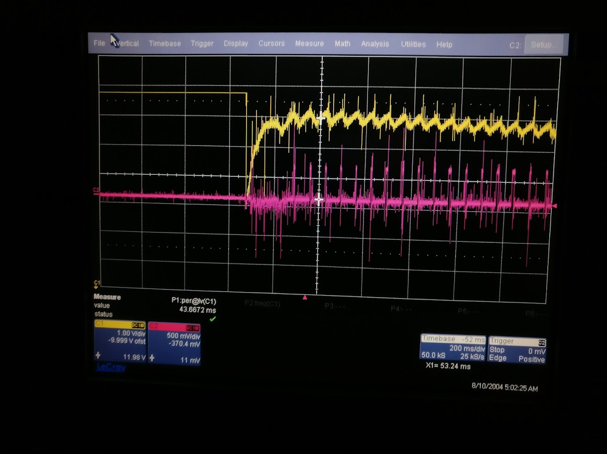

# Formula Student — Driverless Subsystems

*Ü Motorsport (URJC Formula Student team) · UM05 driverless car*

The driverless subsystems I personally designed and built for **Ü Motorsport** — the electronics, steering, braking, sensing, and perception software. The hardware shown here is the team's **UM05** car (my piece of it, not the whole vehicle); the perception stack is the team's open-source cone detector. This is where my autonomy work started, before I went on to lead the [Driverless Kart](kart.md) testbed.

## Driverless perception software

The team's open-source cone-detection stack ([`Deteccion_conos`](https://github.com/UM-Driverless/Deteccion_conos)) — the perception pipeline that locates track cones from the camera feed. I reworked its software architecture and took the loop from roughly **8 to ~50 FPS**, all before the move to ROS 2 and the later AI-era model optimizations.

  

    <iframe
      src="https://www.youtube.com/embed/wZSFr2eYE4M"
      title="How our autonomous kart software works — walkthrough of the legacy Python stack"
      frameborder="0"
      loading="lazy"
      allow="accelerometer; clipboard-write; encrypted-media; gyroscope; picture-in-picture"
      allowfullscreen
      style="position: absolute; top: 0; left: 0; width: 100%; height: 100%;"></iframe>
  

*Walkthrough video — how the perception pipeline works, end to end.*

- **Multithreading** — split the serial capture → detect → control loop so the camera read, detection, and control stages run concurrently instead of blocking each other. Profiling per-section execution time showed the bottleneck shift from the camera (~8 Hz) to detection (~50 Hz).
- **Polymorphic rewrite** — gave every camera source (recorded image, video, webcam, ZED stereo, simulator) one common interface behind a base class, with a factory that selects the right one from a YAML config. Run modes became *configuration* rather than branching — removing the if/else sprawl and making the code reusable and testable.

*What came next: switching to ROS 2, plus FP16 / TensorRT model optimization and sky-cropping, pushed cone detection to 81 FPS on the kart's Jetson Orin — a story for the [Driverless Kart](kart.md) build journey.*

{ loading=lazy }

## Role

**Engineer in Driverless / Electronics** (Jun 2020 – Dec 2021). Designed, soldered, and debugged the PCBs; built the drive-by-wire steering, the redundant pneumatic emergency brake, and the wheel-speed sensorization system; fabricated steel parts in the workshop and carbon-fibre-reinforced-polymer (CFRP) parts in the hangar.

## Driverless electronics — custom PCBs

Designed, hand-soldered, and troubleshot the custom boards that bridge the autonomy compute to the car's actuators and sensors — power regulation, the microcontroller, and the connectorised interface to the vehicle harness.

- { loading=lazy }
- { loading=lazy }

## Electric steering control

Built the drive-by-wire steering for UM05 — the actuator and control loop that let the autonomy stack turn the wheels. During bring-up it was driven manually with a handheld remote so the steering could be validated independently before the computer took over.

<video width="100%" controls playsinline poster="../../images/formula-student/um05-steering-test.jpg">
  <source src="../../videos/um05-steering-test.mp4" type="video/mp4">
</video>

## Redundant emergency brake (EBS)

A safety-critical, fail-safe braking system — the autonomy rules require the car to stop itself on any fault.

- **Pneumatic actuation** — valves and actuators from team sponsor FESTO pull the brake pedal. Gas stored at 200 bar is regulated down to roughly 8 bar (set by the braking force wanted) at the actuators.
- **Fail-safe by design** — a *normally-open* solenoid valve triggers the brake on any problem, so a power loss or fault stops the car rather than leaving it uncontrolled.
- **EBS checker** — a separate non-programmable hardware monitor that watches safety signals (pneumatic pressure, battery voltage, watchdog heartbeats from the other microcontrollers) and fires the brake independently of the main software. Validated on the bench before its PCB was manufactured.

- { loading=lazy }
- { loading=lazy }

## Wheel-speed sensorization

The odometry input for the autonomy stack — built from the sensor up.

- **Sensing** — a reluctor sensor reads the wheel; its sinusoidal output is filtered and squared into clean digital pulses, which the microcontroller counts on its interrupt pins to derive rotational speed. Speed is then published to the main computer over the **CAN bus**.
- **Packaging** — first module assembled in a 3D-printed enclosure mounted to the wheel spindle. Waterproofed, but deliberately **not** potted in resin so it stayed serviceable and modifiable.
- **Validation (SENv_01)** — the reluctor approach was first adapted onto the team's previous car, where it reliably read wheel speed.

- { loading=lazy }
- { loading=lazy }

!!! note "Open issue I left documented"
    At standstill, engine vibration occasionally produced phantom speed readings. A low-pass filter on the sensor signal was the likely fix.

## Debugging: the power-on brownout

A representative failure I tracked down end to end:

!!! note "Symptom → root cause → fix"
    When the car started, the onboard computer cut out. The multimeter showed the rail sagging to **10 V**, yet the computer ran fine at **8 V** on a bench supply — so the steady-state voltage didn't explain the shutdown.

    The cause was the **starter motor's inrush current** producing a much deeper transient drop than the multimeter reading suggested, on a lead-acid battery already degraded by too many cycles. Replacing the battery fixed it. A capacitor bank was tried as a buffer but barely helped and turned out not to be needed.

{ loading=lazy }

## Fabrication

Hands-on build work alongside the electronics: steel parts machined and welded in the workshop, and CFRP components laid up in the hangar.

---

*This work led directly into the [Driverless Kart](kart.md), the autonomous-vehicle testbed I went on to lead as Chief Engineer.*
